# **Finding Lane Lines on the Road** 

## The goals / steps of this project are the following:

* Make a pipeline that finds lane lines on the road
* Reflect on your work in a written report

---
### Project code

Here is my working repository for this project:

https://github.com/pl80tech/CarND-LaneLines-P1

It is imported from below original repository:

https://github.com/udacity/CarND-LaneLines-P1

---

### Reflection

### 1. Describe your pipeline. As part of the description, explain how you modified the draw_lines() function.

#### 1.1 My pipeline consisted of following steps:

* Convert original image to grayscale image
* Apply Gaussian smoothing to the grayscale image
* Apply Canny Edge detection to detect the edges with low/high threshold
* Define a specific polygon (four sides) for masking only the region of interest
* Create a masked edges image based on the defined polygon
* Apply Hough Transform to detect and draw the lane line segments
* Combine the detected segment lines into original image

	**Note**: the parameters which are hard-coded in project file are tuned with test images

#### 1.2 In order to fully extend and draw a single line on the left and right lane, I created draw_full_lines() funtion from draw_lines() function as below:

* Calculate the slope of each line segments
* Devide the segments to right & left ones based on the slope (right segment with positive slope & left segment with negative slope)
* Select the reference points for right & left line. Currently chosing the middle points of the first segments. Will optimize this selection for drawing better line.
* Calculate the positions for the full lines (within masked polygon) based on reference point and average slope of all the left/right segments using the equation y = wx + b (w: weight or slope, b: bias)
* Draw the full lines from the calculated positions

#### 1.3 Here are the images (with line segments and full lines) created by the pipelines:

* solidWhiteRight.jpg

  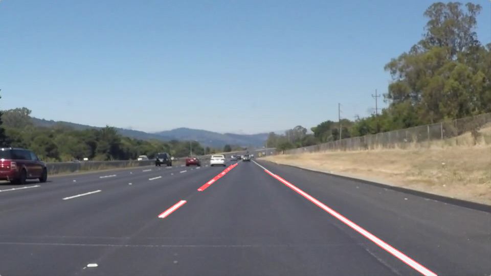
  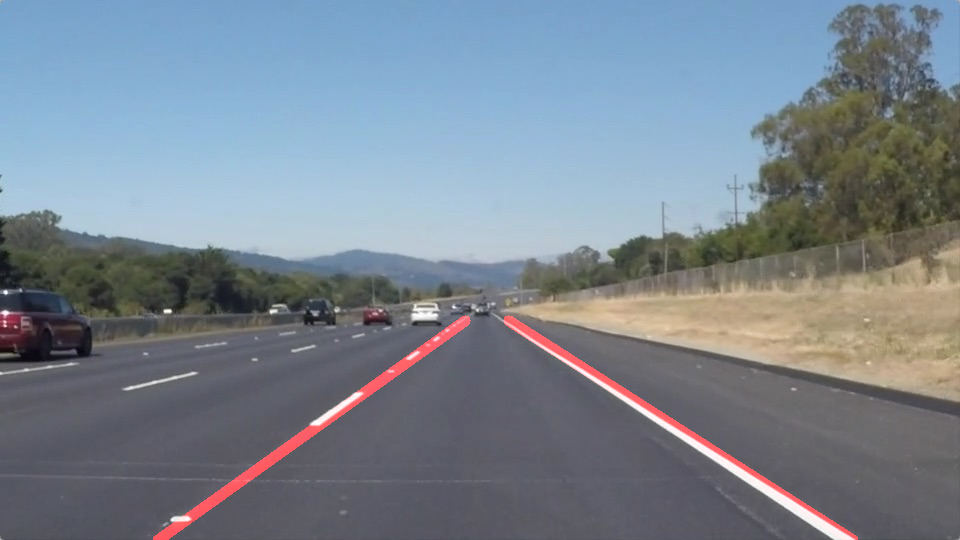

* solidWhiteCurve.jpg

  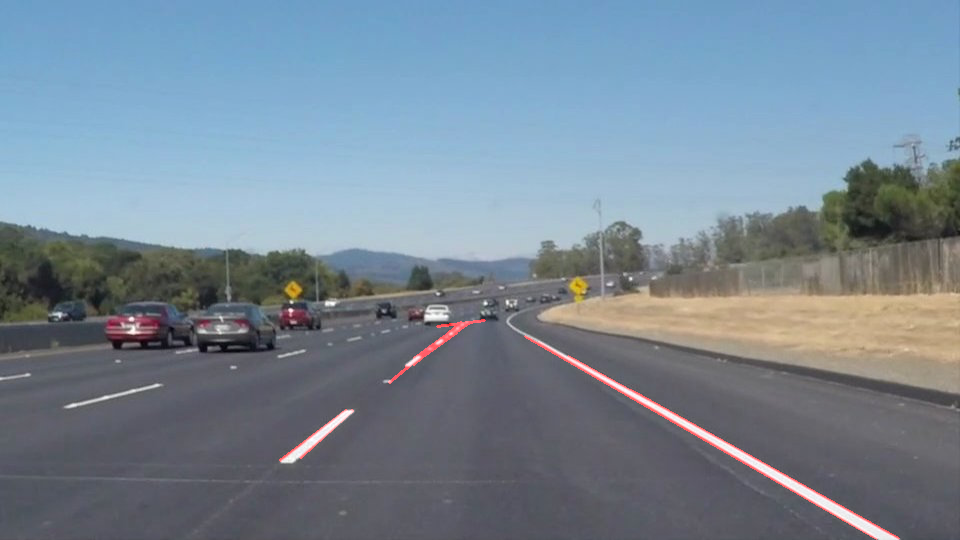
  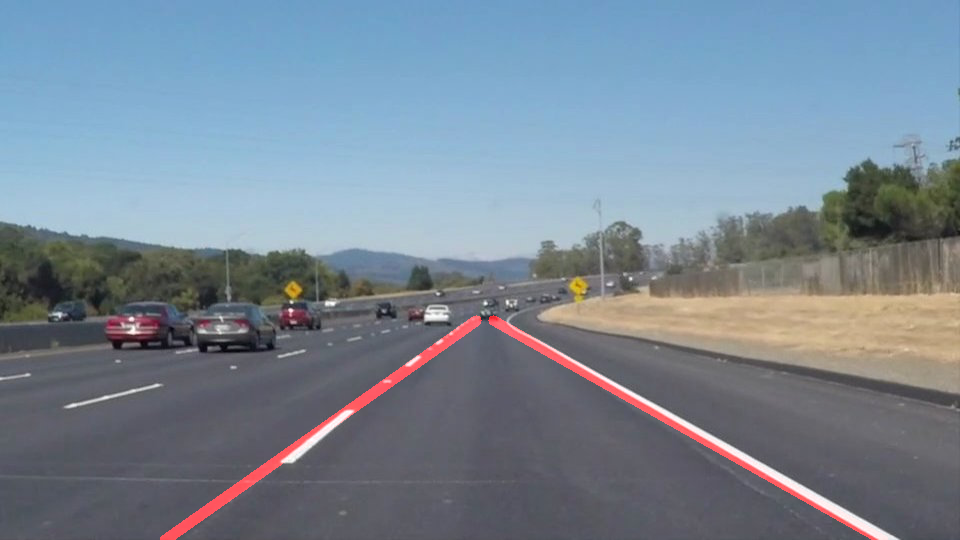

* solidYellowLeft.jpg

  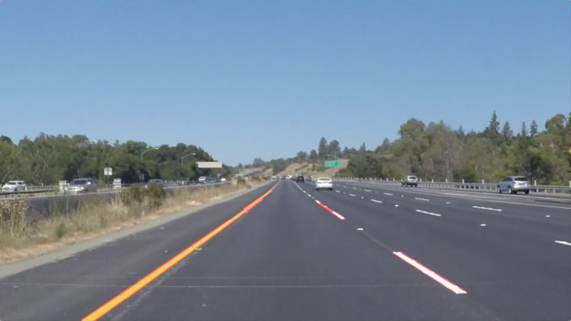
  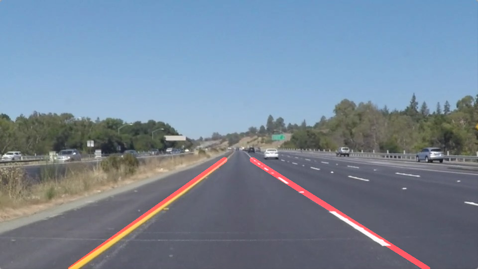

* solidYellowCurve2.jpg

  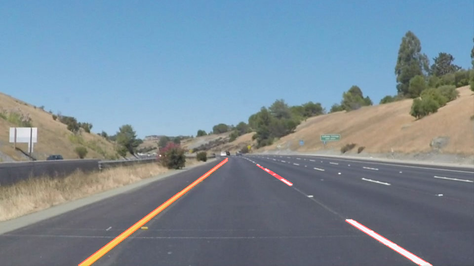
  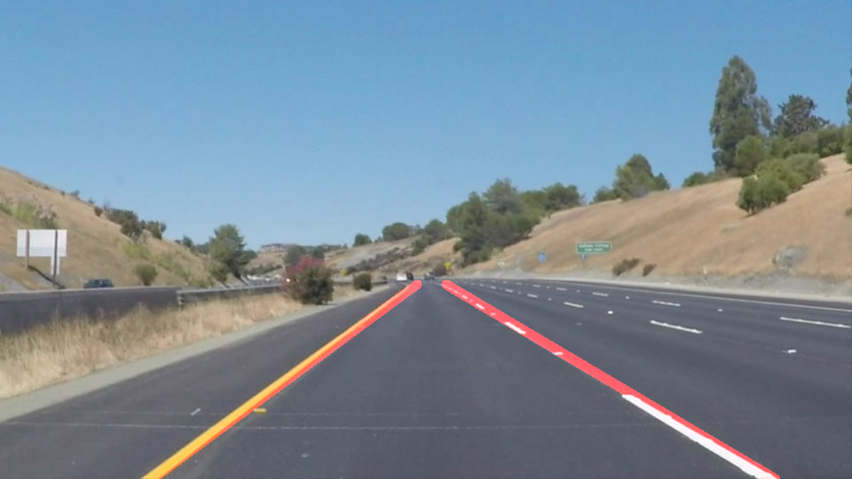

* solidYellowCurve.jpg

  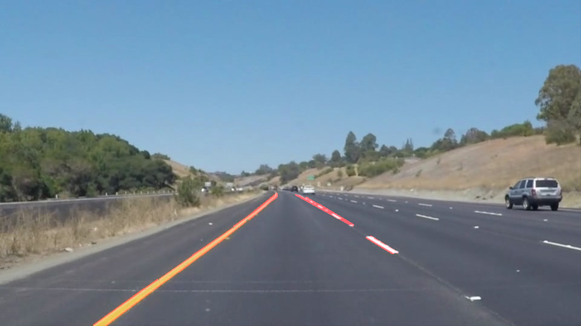
  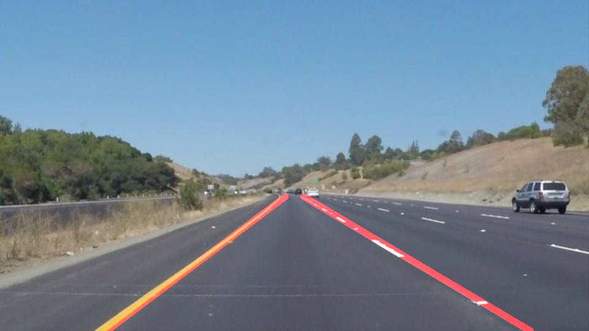

* whiteCarLaneSwitch.jpg

  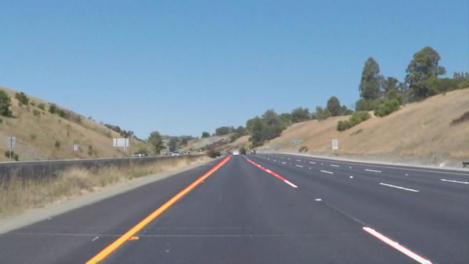
  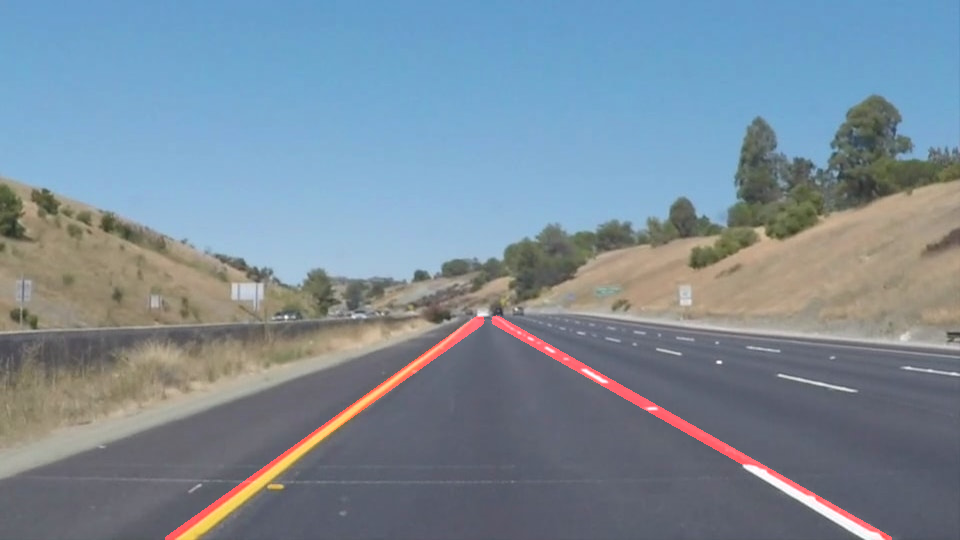

#### 1.4 Here are the videos (with line segments & full lines) created by the whole process:

* From /test_videos/solidWhiteRight.mp4

  <figure class="video_container">
    <video controls="true" allowfullscreen="true" width="320" title="With Line Segments">
      <source src="test_videos_output/solidWhiteRight_segment.mp4" type="video/mp4">
    </video>
    <video controls="true" allowfullscreen="true" width="320" title="With Full Lines">
      <source src="test_videos_output/solidWhiteRight.mp4" type="video/mp4">
    </video>
  </figure>

* From /test_videos/solidYellowLeft.mp4

  <figure class="video_container">
    <video controls="true" allowfullscreen="true" width="320"title="With Line Segments">
      <source src="test_videos_output/solidYellowLeft_segment.mp4" type="video/mp4">
    </video>
    <video controls="true" allowfullscreen="true" width="320" title="With Full Lines">
      <source src="test_videos_output/solidYellowLeft.mp4" type="video/mp4">
    </video>
  </figure>

### 2. Identify potential shortcomings with your current pipeline

Here are some potential shortcomings that need to be improved. As also shown in challenge section (optional) of project file ([link](https://github.com/pl80tech/CarND-LaneLines-P1/blob/master/P1.ipynb)), it can easily be observed by testing current pipeline/process with challenge video (challenge.mp4)

* Many parameters like region of interest, threshold, etc are tuned specifically for test images, test videos and are currently hard-coded in the project. It is not efficient and can't be used in the images/videos with diffrent frame size.

	*For example:*

	Below video is generated after applying current process with challenge video (challenge.mp4, frame size 720 x 1280). The full lines showing in this video are drawn in the region of interest specific for frame size 540 x 960 and not correct when applying to 720 x 1280.

  <figure class="video_container">
    <video controls="true" allowfullscreen="true" width="480" title="Output video after applying current process to challenge video">
      <source src="test_videos_output/challenge.mp4" type="video/mp4">
    </video>
  </figure>

* Even with the same frame size, current pipeline/process is weak when using with images/videos having some unexpected objects (or noises) like tree shadow, car's front side, etc

	*For example:*

	Below video is generated after applying current process with challenge video after resizing it to 540 x 960. The full lines are drawing within expected region but the slope is incorrect and doesn't fit actual lines because it is affected much by the noises.

  <figure class="video_container">
    <video controls="true" allowfullscreen="true" width="480">
      <source src="test_videos_output/challenge_resize.mp4" type="video/mp4">
    </video>
  </figure>

  It can be observed by applying the pipeline to a specific frame from challenge video as below.

  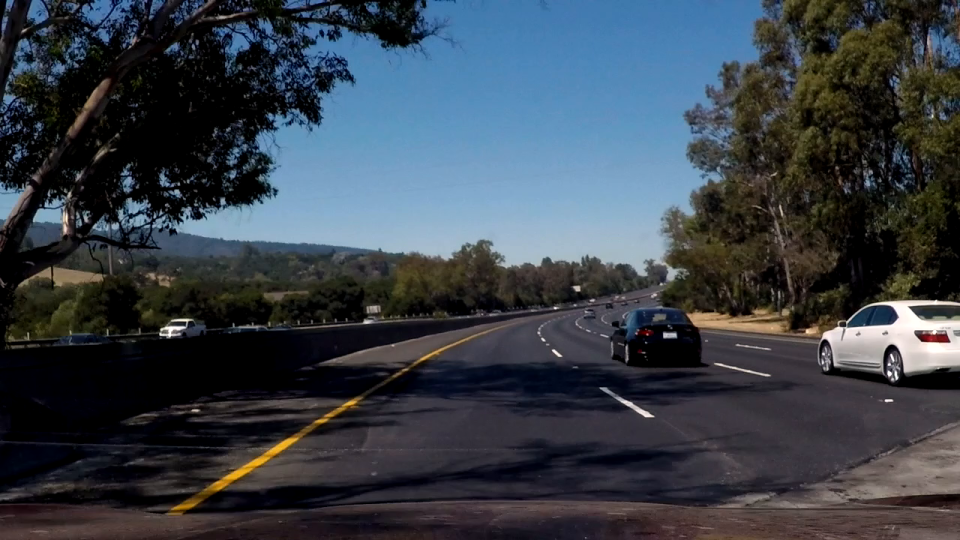
  

* In comparison with reference video (P1_example.mp4, right one), the full lines shown in my output video (left one) is not stable enough. It may be caused by the process to select the reference point to draw the full line with average slope. Currently, I only choose it roughly by selecting the middle point of the first segment from the filtered data, which is not good enough to calculate the full line and represent it well in some cases.

  <figure class="video_container">
    <video controls="true" allowfullscreen="true" width="320" title="With Full Lines">
      <source src="test_videos_output/solidWhiteRight.mp4" type="video/mp4">
    </video>
    <video controls="true" allowfullscreen="true" width="320" title="Reference video">
      <source src="examples/P1_example.mp4" type="video/mp4">
    </video>
  </figure>

### 3. Suggest possible improvements to your pipeline

Here are possible modifications that can improve the pipeline:

* Improve the way to select the parameters (like region of interest) so that it can be used in more generalized cases.
* Use somes thresholds to filter & remove the segment whose absolute value of its slope is very low or very high. It can help to remove some segments caused by unexpected objects or the noises. Selecting a limited range of slope for filtering based on its distribution may be a good approach.
* Optimize the reference point and the way to draw the full lines to fit more precisely with actual lines. Selecting middle point of the segments whose slope is nearest to average slope may be a good approach.

Here is the result after applying some of the solutions mentioned above with very rough implementation. More implementation & fine-tune are needed but we can observe some small improvements on challenge video.

  <figure class="video_container">
    <video controls="true" allowfullscreen="true" width="480" title="Some improvements for challenge video">
      <source src="test_videos_output/challenge_resize_improve.mp4" type="video/mp4">
    </video>
  </figure>